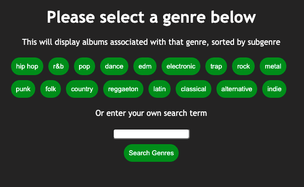

# New Music Browser

This React app makes use of Spotify's API to allow users to browse through more new releases than are available on Spotify's browser and also to sort them by genre.

## Instructions

The github-pages deployment can be found [here](https://dpbates13.github.io/new-music-browser/). If you are interested in deploying on your local device, please see installation instructions below.

When the app initially loads, it takes a few seconds to load data from the back end. After this data is loaded, you can then click the genre buttons to begin your search or enter your own search term in the search bar.

Doing either will bring up a list of all genre labels which contain that term as well as a list of all albums with genres that caontain that term. You can click on the genre labels to fruther refine your search. Clicking on album titles will open that album page in your Spotify player.

## Installation

Requires Node.js to be installed on your device. After the code is forked to your local system, use 'npm install' to install all dependencies. The command 'npm start' can be used to deploy a local version of the app. Other useful commands can be found in the [Create React App readme](https://github.com/facebook/create-react-app)
